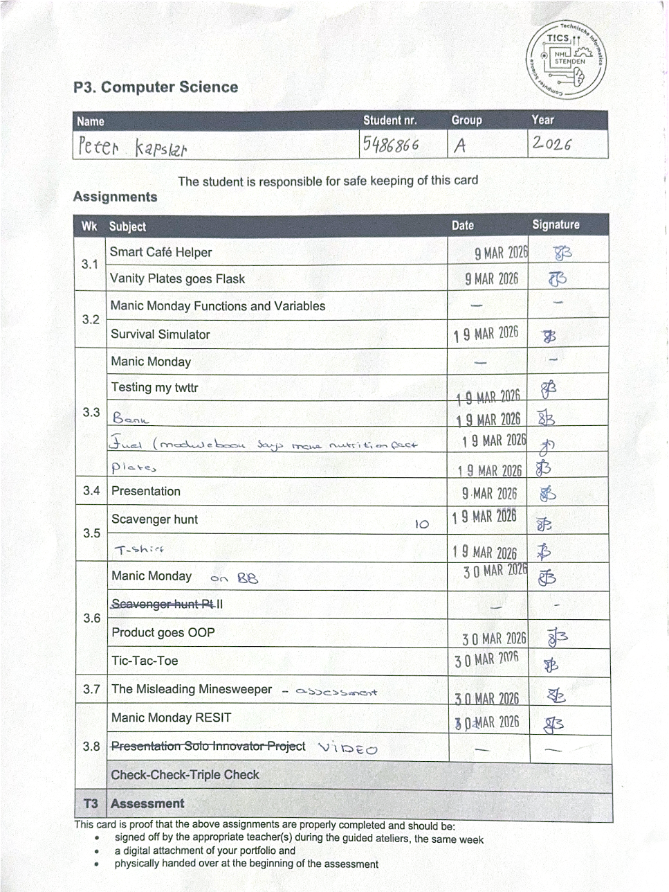

# Digital portfolio Embedded systems Y1 P3
- Name: Peter Kapsiar
- Student ID: 5486866
- Repository: https://github.com/pop9459/P3-ComputerScience

## Assignment card



## Smart Cafe helper

### Description

### Code
`main.py`
```python
def welcome_message():
    welcome_message = "Welcome to Smart Cafe!"
    print(welcome_message)

    user_input = input("Would you like to customize the welcome message? (yes/no): ").lower()
    if user_input == "yes":
        welcome_message = input("Enter your custom message: ")

    print(transform_message(welcome_message))

def transform_message(input_message):
    new_message = ""
    for char in input_message:
        new_message = new_message + char + "..."
    
    new_message = new_message.removesuffix("...")

    return new_message

def process_orders():
    total_order_price = 0

    # do while loop
    while True:
        # Get order item
        user_input = input("Please enter your order or type 'done' to finish: ").lower()
        order_output = get_item_type(user_input)
        if(order_output == False):
            break
        else:
            energy_coeficient = order_output

        # Calculate energy
        user_input = input("Would you like to calculate energy? (yes/no): ").lower()
        if(user_input == "yes"):
            print(f"Energy: {calculate_energy(energy_coeficient)} Joules")

        # Increment price
        total_order_price += get_item_price()

    print(f"Your total is ${total_order_price}.")

    price_after_tip = process_tip(total_order_price)
    print(f"With tip, your total is: ${price_after_tip}")

def process_tip(price_before_tip):
    while True:
        user_input = float(input("How much tip would you like to add? (10, 15, 20): "))
        price_after_tip = price_before_tip + price_before_tip * (user_input / 100)

        return price_after_tip

def get_item_type(user_input):
        match user_input:
            case "done":
                #finish ordering
                return False
            case "coffe":
                order_item = "☕"
                energy_coeficient = 1
            case "tea":
                order_item = "🫖"
                energy_coeficient = 2
            case "cake":
                order_item = "🍰"
                energy_coeficient = 3
            case "cookie":
                order_item = "🍪"
                energy_coeficient = 4
            case "cheese":
                order_item = "🧀"
                energy_coeficient = 5
            case _:
                order_item = user_input.lower()
                energy_coeficient = 0.5
                pass

        print("Okay, I will prepare " + order_item)
        return energy_coeficient

def get_item_price():
    user_input = input("Please enter the price of this item: ")
    item_price = float(user_input.removeprefix("$"))
    return item_price
    

def calculate_energy(energy_coeficient):
    item_weight = float(input("Enter the weight in grams: "))
    item_energy = item_weight * pow(energy_coeficient, 2)
    return item_energy


if __name__ == "__main__":
    welcome_message()
    process_orders()
    print("Thank you for visiting Smart Cafe!")
```

### Output

## Vanity plates goes Flask

### Description

### Code
`main.py`
```python
from endpoints import *
from db_handler import *


# ##### Main execution #####
if __name__ == "__main__":
    db_initialize()
    flask_api.run(debug=True)
```

`endpoints.py`
```python
from flask import Flask, jsonify, request
from db_handler import *
from plate_checker import *

# ##### Object initialization #####
flask_api = Flask(__name__)

# ##### Define the API endpoints #####
@flask_api.get("/")
def index():
    return jsonify({"message": "Vanity plate API is running"})

@flask_api.post("/validate")
def validate_plate():
    # Get the JSON data from the request.
    data = request.get_json(silent=True) or {}
    plate = data.get("plate", "")

    if not isinstance(plate, str):
        return jsonify({"error": "'plate' must be a string"}), 400

    return jsonify({
        "plate": plate,
        "valid": is_valid(plate)
    })

@flask_api.post("/register")
def register_plate():
    # Get the JSON data from the request.
    data = request.get_json(silent=True) or {}
    plate = data.get("plate", "")

    if not isinstance(plate, str):
        return jsonify({"error": "'plate' must be a string"}), 400

    if not is_valid(plate):
        return jsonify({
            "plate": plate,
            "inserted": False,
            "reason": "Invalid plate format"
        }), 400
    
    if not add_plate_to_db(plate):
        return jsonify({
            "plate": plate,
            "inserted": False,
            "reason": "Plate already registered"
        }), 400
    
    return jsonify({
        "plate": plate,
        "inserted": True
    })

@flask_api.get("/plates")
def list_plates():
    return jsonify({"plates": get_registered_plates()})
```

`db_handler.py`
```python
import sqlite3

# ##### CONSTANTS #####
DATABASE_NAME = 'plates.db'

# ##### Function definitions #####
def add_plate_to_db(s):
    conn = sqlite3.connect(DATABASE_NAME)
    cur = conn.cursor()
    try:
        cur.execute("INSERT INTO plates (plate) VALUES (?)", (s,))
        conn.commit()
        return True
    except sqlite3.IntegrityError:
        # This error occurs if the plate already exists in the database
        return False
    finally:
        conn.close()

def db_initialize():
    conn = sqlite3.connect('plates.db')
    cur = conn.cursor()
    cur.execute('''
        CREATE TABLE IF NOT EXISTS plates (
            id INTEGER PRIMARY KEY AUTOINCREMENT,
            plate TEXT UNIQUE NOT NULL
        )
    ''')
    conn.commit()
    conn.close()

def get_registered_plates():
    conn = sqlite3.connect(DATABASE_NAME)
    cur = conn.cursor()
    cur.execute("SELECT plate FROM plates")
    plates = [row[0] for row in cur.fetchall()]
    conn.close()
    return plates
```

### Output

## Survival simulator

### Description

### Code
`main.py`
```python
from game import SurvivalSimulator

if __name__ == "__main__":
    game = SurvivalSimulator()
    game.start()
```

`game.py`
```python
from challenge import Challenge
from fileExtensionsChallenge import FileExtensionsChallenge
from mathInterpreterChallenge import mathInterpreterChallenge
from nutritionFactsChallenge import NutritionFactsChallenge
from camelCaseDecoderChallenge import CamelCaseDecoderChallenge
from emojizeChallenge import EmojizeChallenge
from guessingGameChallenge import GuessingGameChallenge

class SurvivalSimulator:
    challenges = []
    
    def __init__(self):
        # Initialize the game and add challenges
        self.challenges.append(FileExtensionsChallenge())
        self.challenges.append(mathInterpreterChallenge())
        self.challenges.append(NutritionFactsChallenge())
        self.challenges.append(CamelCaseDecoderChallenge())
        self.challenges.append(EmojizeChallenge())
        self.challenges.append(GuessingGameChallenge())


    def exitGame(self):
        print("Thanks for playing! See you next time.")
        exit()


    def showWelcomeMessage(self):
        print("Welcome to the Survival Simulator!")
        print("You are in an abandoned supermarket and must solve puzzles to escape!")


    def menu(self):

        num_challenges = len(self.challenges)

        # Display the menu options
        print("\nChoose an option:")        
        for index, challenge in enumerate(self.challenges):
            print(f"{index + 1}. {challenge.menuName}")
        print(num_challenges + 1, ". Exit")

        user_input = int(input(f"Make a choice (1-{num_challenges + 1}): "))

        if(user_input <= num_challenges):
            self.challenges[int(user_input) - 1].playChallenge()
        elif(user_input == num_challenges + 1):
            self.exitGame()
        else:
            print("Invalid choice. Please try again.")


    def gameComplete(self):
        return all(challenge.completed for challenge in self.challenges)


    def start(self):
        self.showWelcomeMessage()

        while self.gameComplete() == False:
            self.menu()

        self.exitGame()
```

`challenge.py`
```python
class Challenge:
    menuName = ""
    completed = False

    def playChallenge(self):
        pass
```

`fileExtensionChallenge.py`
```python
from challenge import Challenge


class FileExtensionsChallenge(Challenge):
    menuName = "File Extensions: What's in this file?"
    
    def playChallenge(self):
        super().playChallenge()

        file_name = "recipe.pdf"

        print(f"You find a file named '{file_name}'.")
        user_input = input("Type the name of the file to check its extension: ")

        success = user_input == file_name

        if success:
            print(f"This is a {file_name.split(".")[1].upper()} file containing a {file_name.split(".")[0]}!")
            self.completed = True
        else:
            print("That's not the correct file name. Try again!")

        return success
```

`mathInterpreterChallenge.py`
```python
import random
from challenge import Challenge


class mathInterpreterChallenge(Challenge):
    menuName = "Math Interpreter: Unlock the safe"

    def playChallenge(self):
        super().playChallenge()

        print("A safe unlocks only with the correct mathematical calculation.")
        
        user_input = input("Enter the mathematical expression (e.g., 2 + 3 * 4): ")

        try:
            result = eval(user_input)
        except Exception as e:
            print("Invalid expression! Try again.")
            return False
        
        print(f"The result is: {result}. The safe opens!")
        self.completed = True
        return True
```

`nutritionFactsChallenge.py`
```python
from challenge import Challenge
from foodItem import FoodItem


class NutritionFactsChallenge(Challenge):
    menuName = "Nutrition Facts: Prepare a meal"
    needed_calories = 500
    food_items = [
        FoodItem("Apple", 95),
        FoodItem("Banana", 105),
        FoodItem("cookie", 150),
        FoodItem("sandwich", 300),
        FoodItem("water", 0)
    ]
    
    
    def playChallenge(self):
        super().playChallenge()
    
        print(f"You need to prepare a meal with {self.needed_calories} calories to proceed.")
        print("Available options: apple, banana, cookie, sandwich, water")

        total_calories = 0

        while total_calories < 500:
            user_input = input("Choose a food item to add to your meal: ").lower()

            matching_items = [item for item in self.food_items if item.name.lower() == user_input]

            if not matching_items:
                print("Invalid food item! Try again.")
                continue

            selected_item = matching_items[0]
            
            total_calories += selected_item.calories
            print(f"{selected_item.name.capitalize()} added! Total calories: {total_calories}")

        print("Congratulations! You  Your meal is complete, and you have enough energy.")
        self.completed = True
        return True
```

`foodItem.py`
```python
class FoodItem:
    def __init__(self, name, calories):
        self.name = name
        self.calories = calories
```

`camelCaseDecoderChallenge.py`
```python
from challenge import Challenge


class CamelCaseDecoderChallenge(Challenge):
    menuName = "CamelCase Decoder: Decode the message"
    message = "EscapeNowThroughDoor"

    def playChallenge(self):
        super().playChallenge()

        print(f"You find a message in camelCase: '{self.message}'")

        user_input = input("Type the CamelCase message to decode it: ")

        decoded_message = ""
        for ch in user_input:
            if ch.isupper() and decoded_message:
                decoded_message += " "
            decoded_message += ch
        
        decoded_message = decoded_message.strip()

        print("Decoded message: " + decoded_message)
        self.completed = True
        return True
```

`emojizeChallenge.py`
```python
from challenge import Challenge


class EmojizeChallenge(Challenge):
    menuName = "Emojize: Guess the clue"


    def playChallenge(self):
        super().playChallenge()

        print("You find a clue in emojis: 🍎 🍌 🍪")
        
        user_input = input("What do these emojis mean? (Hint: food): ").lower().strip()
        
        if user_input == "apple banana cookie":
            print("Correct! You receive a key.")
            self.completed = True
            return True
        else:
            print("That's not correct. Try again!")
            return False
```

`guessingGameChallenge.py`
```python
from random import randint
from challenge import Challenge


class GuessingGameChallenge(Challenge):
    menuName = "Guessing Game: Guess the secret code"

    min_value = 1
    max_value = 10
    attempts = 3
    secret = None


    def playChallenge(self):
        super().playChallenge()

        secret = randint(self.min_value, self.max_value)

        print(f"A secret code (between {self.min_value} and {self.max_value}) must be guessed.")

        for attempt in range(self.attempts):
            user_input = int(input(f"Guess the code (attempts left: {self.attempts-attempt}): "))
            
            if user_input == secret:
                print("Correct! The door opens.")
                self.completed = True
                return True
            elif user_input < secret:
                print("Too low!")
            else:
                print("Too high!")
        
        print(f"Unfortunately! The code was {secret}.")
        return False
```

### Output

## Testing my twttr

### Description

### Code
`twttr.py`
```python
def main():
    input_word = input()
    print(shorten(input_word))


def shorten(word):
    word = word.replace("a", "")
    word = word.replace("e", "")
    word = word.replace("i", "")
    word = word.replace("o", "")
    word = word.replace("u", "")
    word = word.replace("A", "")
    word = word.replace("E", "")
    word = word.replace("I", "")
    word = word.replace("O", "")
    word = word.replace("U", "")


    return word


if __name__ == "__main__":
    main()
```

`test_twttr.py`
```python
from twttr import shorten


def test_shorten():
    assert shorten("twitter") == "twttr"
    assert shorten("TWITTER") == "TWTTR"
    assert shorten("aeiouAEIOU") == ""
    assert shorten("bcdfgBCDFG") == "bcdfgBCDFG"
    assert shorten("Hello, World!") == "Hll, Wrld!"

    print("All tests passed!")
```

### Output

## Bank testing

### Description

### Code
`bank.py`
```python
def main():
    user_input = input("Enter a greeting: ")
    result = value(user_input)
    print(f"The value of the greeting is: ${result}")


def value(greeting):
    greeting = greeting.lower().strip()
    if greeting.startswith("hello"):
        return 0
    elif greeting.startswith("h"): 
        return 20
    else:
        return 100


if __name__ == "__main__":
    main()
```

`test_bank.py`
```python
from bank import value

def test_value():
    assert value("Hello") == 0
    assert value("hello") == 0
    assert value("hello there") == 0
    assert value("  Hello  ") == 0
    assert value("Hi") == 20
    assert value("h") == 20
    assert value("Hey") == 20
    assert value("  Hi  ") == 20
    assert value("Good morning") == 100
    assert value("Welcome") == 100
    assert value("  Good morning  ") == 100
```

### Output

## Fuel testing

### Description

### Code
`fuel.py`
```python
def main():
    while True:
        try:
            input_fraction = input("Fraction: ")
            fuel_gauge = gauge(convert(input_fraction))
        except (ValueError, ZeroDivisionError):
            pass
        else:
            break
    
    print(fuel_gauge)


def convert(fraction):
    if fraction.count("/") != 1:
        raise ValueError("Invalid input")

    fraction = fraction.split("/")
    X = int(fraction[0])
    Y = int(fraction[1])

    if Y == 0:
        raise ZeroDivisionError("Denominator cannot be zero")
    if X > Y:
        raise ValueError("Numerator cannot be greater than denominator")

    percentage = int((X/Y) * 100)

    return percentage


def gauge(percentage):
    if percentage <= 1:
        return "E"
    elif percentage >= 99:
        return "F"
    else:
        return f"{percentage:.0f}%"


if __name__ == "__main__":
    main()
```

`test_fuel.py`
```python
import pytest
from fuel import convert, gauge
    

def test_convert():
    assert convert("0/1") == 0, "Expected 0 for 0/1"
    assert convert("1/4") == 25, "Expected 25 for 1/4"
    assert convert("1/2") == 50, "Expected 50 for 1/2"
    assert convert("3/4") == 75, "Expected 75 for 3/4"
    assert convert("1/1") == 100, "Expected 100 for 1/1"

    with pytest.raises(ZeroDivisionError):
        convert("1/0")
    with pytest.raises(ValueError):
        convert("2/1")
    with pytest.raises(ValueError):
        convert("1/2/3")
    with pytest.raises(ValueError):
        convert("abc")

def test_gauge():
    assert gauge(25) == "25%", "Expected '25%' for 25%"
    assert gauge(50) == "50%", "Expected '50%' for 50%"
    assert gauge(75) == "75%", "Expected '75%' for 75%"

    assert gauge(0) == "E", "Expected 'E' for 0%"
    assert gauge(1) == "E", "Expected 'E' for 1%"
    assert gauge(99) == "F", "Expected 'F' for 99%"
    assert gauge(100) == "F", "Expected 'F' for 100%"
```

### Output

## Plates testing

### Description

### Code
`plate_checker.py`
```python
def is_valid(s):
    if(len(s) < 2 or len(s) > 6):
        # The length of the plate must be between 2 and 6 characters
        return False
    if not s[0].isalpha() or not s[1].isalpha():
        # The first two characters must be letters
        return False
    if not check_number_position(s):
        # The numbers must be at the end of the plate and cannot start with 0
        return False
    if not s.isalnum():
        # The plate must only contain letters and numbers 
        return False
    
    # Return True if all conditions are satisfied
    return True

def check_number_position(s):
    numbers_started = False

    for char in s:
        if char.isdigit():
            if char == "0" and not numbers_started:
                return False
            numbers_started = True
            continue

        if char.isalpha() and numbers_started:
            return False

    return numbers_started
```

`test_plate_checker.py`
```python
import pytest
from plate_checker import is_valid

def test_is_valid_charlength():
    assert is_valid("CS50") == True, "CS50 Should be an accepted length"
    assert is_valid("C") == False, "C should be marked as too short"
    assert is_valid("CS5000000") == False, "CS5000000 should me marked as too long" 
    
def test_is_valid_first_chars_letters():
    assert is_valid("CS50") ==  True, "CS50 Should be accepted because its first 2 characters are letters"
    assert is_valid("C50") == False, "C50 should be marked as invalid because its first 2 characters are not letters"
    assert is_valid("5CS") == False, "5CS should be marked as invalid because its first 2 characters are not letters"
    

def test_is_valid_numbers_position():
    assert is_valid("CS50") == True, "CS50 should be accepted because its numbers are at the end and do not start with 0"
    assert is_valid("CS05") == False, "CS05 should be marked as invalid because its numbers start with 0"
    assert is_valid("CS50P") == False, "CS50P should be marked as invalid because its numbers are not at the end"
    

def test_is_valid_only_letters_and_numbers():
    assert is_valid("CS50") == True, "CS50 should be accepted because it only contains letters and numbers"
    assert is_valid("PI3.14") == False, "PI3.14 should be marked as invalid because it contains a period"
    assert is_valid("H$3") == False, "H$3 should be marked as invalid because it contains a dollar sign"
```

### Output

## T-shirt

### Description

### Code
`shirt.py`
```python
import sys
import os
from PIL import Image, ImageOps

PATH = os.path.dirname(__file__)
SHIRT_PATH = os.path.join(PATH, "shirt.png")
ALLOWED_EXTENSIONS = ('.jpg', '.jpeg', '.png')

def main():
    # Validate command-line arguments
    if len(sys.argv) != 3:
        print("Usage: python shirt.py input_image output_image")
        sys.exit(1)
    
    input_img_path = os.path.join(PATH, sys.argv[1])
    output_img_path = os.path.join(PATH, sys.argv[2])
    
    if not input_img_path.lower().endswith(ALLOWED_EXTENSIONS):
        print("Error: Input file must be a .jpg, .jpeg, or .png image.")
        sys.exit(1)

    if not input_img_path.split('.')[1].lower() == output_img_path.split('.')[1].lower():
        print("Error: Input and output file extensions must match.")
        sys.exit(1)

    try:
        input_img = Image.open(input_img_path)
    except FileNotFoundError:
        print(f"Error: File '{input_img_path}' not found.")
        sys.exit(1)
    

    # Resize input image to fit shirt template
    shirt_img = Image.open(SHIRT_PATH)
    input_img = ImageOps.fit(input_img, shirt_img.size)

    # Overlay the shirt template onto the input image using Image.paste()
    input_img.paste(shirt_img, (0, 0), shirt_img)

    # Save the resulting image
    input_img.save(output_img_path)
    

if __name__ == "__main__":
    main()
```

### Output

## Tic-Tac-Toe

### Description

### Code
`runner.py`
```python
import pygame
import sys
import time

import tictactoe as ttt

pygame.init()
size = width, height = 600, 400

# Colors
black = (0, 0, 0)
white = (255, 255, 255)

screen = pygame.display.set_mode(size)

mediumFont = pygame.font.Font("OpenSans-Regular.ttf", 28)
largeFont = pygame.font.Font("OpenSans-Regular.ttf", 40)
moveFont = pygame.font.Font("OpenSans-Regular.ttf", 60)

user = None
board = ttt.initial_state()
ai_turn = False

while True:

    for event in pygame.event.get():
        if event.type == pygame.QUIT:
            sys.exit()

    screen.fill(black)

    # Let user choose a player.
    if user is None:

        # Draw title
        title = largeFont.render("Play Tic-Tac-Toe", True, white)
        titleRect = title.get_rect()
        titleRect.center = ((width / 2), 50)
        screen.blit(title, titleRect)

        # Draw buttons
        playXButton = pygame.Rect((width / 8), (height / 2), width / 4, 50)
        playX = mediumFont.render("Play as X", True, black)
        playXRect = playX.get_rect()
        playXRect.center = playXButton.center
        pygame.draw.rect(screen, white, playXButton)
        screen.blit(playX, playXRect)

        playOButton = pygame.Rect(5 * (width / 8), (height / 2), width / 4, 50)
        playO = mediumFont.render("Play as O", True, black)
        playORect = playO.get_rect()
        playORect.center = playOButton.center
        pygame.draw.rect(screen, white, playOButton)
        screen.blit(playO, playORect)

        # Check if button is clicked
        click, _, _ = pygame.mouse.get_pressed()
        if click == 1:
            mouse = pygame.mouse.get_pos()
            if playXButton.collidepoint(mouse):
                time.sleep(0.2)
                user = ttt.X
            elif playOButton.collidepoint(mouse):
                time.sleep(0.2)
                user = ttt.O

    else:

        # Draw game board
        tile_size = 80
        tile_origin = (width / 2 - (1.5 * tile_size),
                       height / 2 - (1.5 * tile_size))
        tiles = []
        for i in range(3):
            row = []
            for j in range(3):
                rect = pygame.Rect(
                    tile_origin[0] + j * tile_size,
                    tile_origin[1] + i * tile_size,
                    tile_size, tile_size
                )
                pygame.draw.rect(screen, white, rect, 3)

                if board[i][j] != ttt.EMPTY:
                    move = moveFont.render(board[i][j], True, white)
                    moveRect = move.get_rect()
                    moveRect.center = rect.center
                    screen.blit(move, moveRect)
                row.append(rect)
            tiles.append(row)

        game_over = ttt.terminal(board)
        player = ttt.player(board)

        # Show title
        if game_over:
            winner = ttt.winner(board)
            if winner is None:
                title = f"Game Over: Tie."
            else:
                title = f"Game Over: {winner} wins."
        elif user == player:
            title = f"Play as {user}"
        else:
            title = f"Computer thinking..."
        title = largeFont.render(title, True, white)
        titleRect = title.get_rect()
        titleRect.center = ((width / 2), 30)
        screen.blit(title, titleRect)

        # Check for AI move
        if user != player and not game_over:
            if ai_turn:
                time.sleep(0.5)
                move = ttt.minimax(board)
                board = ttt.result(board, move)
                ai_turn = False
            else:
                ai_turn = True

        # Check for a user move
        click, _, _ = pygame.mouse.get_pressed()
        if click == 1 and user == player and not game_over:
            mouse = pygame.mouse.get_pos()
            for i in range(3):
                for j in range(3):
                    if (board[i][j] == ttt.EMPTY and tiles[i][j].collidepoint(mouse)):
                        board = ttt.result(board, (i, j))

        if game_over:
            againButton = pygame.Rect(width / 3, height - 65, width / 3, 50)
            again = mediumFont.render("Play Again", True, black)
            againRect = again.get_rect()
            againRect.center = againButton.center
            pygame.draw.rect(screen, white, againButton)
            screen.blit(again, againRect)
            click, _, _ = pygame.mouse.get_pressed()
            if click == 1:
                mouse = pygame.mouse.get_pos()
                if againButton.collidepoint(mouse):
                    time.sleep(0.2)
                    user = None
                    board = ttt.initial_state()
                    ai_turn = False

    pygame.display.flip()
```

`tictactoe.py`
```python
"""
Tic Tac Toe Player
"""

import math

X = "X"
O = "O"
EMPTY = None


def initial_state():
    """
    Returns starting state of the board.
    """
    return [[EMPTY, EMPTY, EMPTY],
            [EMPTY, EMPTY, EMPTY],
            [EMPTY, EMPTY, EMPTY]]


def player(board):
    """
    Returns player who has the next turn on a board.
    """
    # Count number of X's and O's on the board
    x_count = 0
    o_count = 0
    for row in board:
        for cell in row:
            if cell == X:
                x_count += 1
            elif cell == O:
                o_count += 1
    
    # If X has more moves, it's O's turn, otherwise it's X's turn
    if x_count > o_count:
        return O
    else:
        return X


def actions(board):
    """
    Returns set of all possible actions (i, j) available on the board.
    """
    possible_actions = set()
    for i in range(3):
        for j in range(3):
            if board[i][j] == EMPTY:
                possible_actions.add((i, j))
    return possible_actions


def result(board, action):
    """
    Returns the board that results from making move (i, j) on the board.
    """
    if action not in actions(board):
        raise Exception("Invalid action")
    
    # Create a deep copy of the board
    new_board = [row.copy() for row in board]
    
    # Apply the action to the new board
    i, j = action
    new_board[i][j] = player(board)
    
    return new_board

def winner(board):
    """
    Returns the winner of the game, if there is one.
    """
    # Check horizontal lines for winner
    if board[0][0] == board[0][1] == board[0][2] != EMPTY:
        return board[0][0]
    if board[1][0] == board[1][1] == board[1][2] != EMPTY:
        return board[1][0]
    if board[2][0] == board[2][1] == board[2][2] != EMPTY:
        return board[2][0]
    
    # Check vertical lines for winner
    if board[0][0] == board[1][0] == board[2][0] != EMPTY:
        return board[0][0]
    if board[0][1] == board[1][1] == board[2][1] != EMPTY:
        return board[0][1]
    if board[0][2] == board[1][2] == board[2][2] != EMPTY:
        return board[0][2]
    
    # Check diagonals for winner
    if board[0][0] == board[1][1] == board[2][2] != EMPTY:
        return board[0][0]
    if board[0][2] == board[1][1] == board[2][0] != EMPTY:
        return board[0][2]
    
    # No winner
    return None


def terminal(board):
    """
    Returns True if game is over, False otherwise.
    """
    if winner(board) is not None:
        # Winner - game is over
        return True

    # Check for tie
    for row in board:
        for cell in row:
            if cell == EMPTY:
                # Empty cell - not over
                return False
            
    # No winner and no empty cells - tie - game is over
    return True

def utility(board):
    """
    Returns 1 if X has won the game, -1 if O has won, 0 otherwise.
    """
    win = winner(board)
    if win == X:
        return 1
    elif win == O:
        return -1
    else:
        return 0
    

def minimax(board):
    """
    Returns the optimal action for the current player on the board.
    """
    if terminal(board):
        return None

    current_player = player(board)
    best_move = None

    if current_player == X:
        best_value = -math.inf
        for move in actions(board):
            value = minimax_value(result(board, move))
            if value > best_value:
                best_value = value
                best_move = move
    else:
        best_value = math.inf
        for move in actions(board):
            value = minimax_value(result(board, move))
            if value < best_value:
                best_value = value
                best_move = move

    return best_move

def minimax_value(board):
    """
    Returns the minimax value of a board state.
    """
    if terminal(board):
        return utility(board)

    current_player = player(board)
    values = [minimax_value(result(board, move)) for move in actions(board)]

    if current_player == X:
        return max(values)
    return min(values)
```

### Output

## The misleading minesweeper

### Description

### Code
`runner.py`
```python
import pygame
import sys
import time

from minesweeper import Minesweeper, MinesweeperAI

HEIGHT = 8
WIDTH = 8
MINES = 8

# Colors
BLACK = (0, 0, 0)
GRAY = (180, 180, 180)
WHITE = (255, 255, 255)

# Create game
pygame.init()
size = width, height = 600, 400
screen = pygame.display.set_mode(size)

# Fonts
OPEN_SANS = "assets/fonts/OpenSans-Regular.ttf"
smallFont = pygame.font.Font(OPEN_SANS, 20)
mediumFont = pygame.font.Font(OPEN_SANS, 28)
largeFont = pygame.font.Font(OPEN_SANS, 40)

# Compute board size
BOARD_PADDING = 20
board_width = ((2 / 3) * width) - (BOARD_PADDING * 2)
board_height = height - (BOARD_PADDING * 2)
cell_size = int(min(board_width / WIDTH, board_height / HEIGHT))
board_origin = (BOARD_PADDING, BOARD_PADDING)

# Add images
flag = pygame.image.load("assets/images/flag.png")
flag = pygame.transform.scale(flag, (cell_size, cell_size))
mine = pygame.image.load("assets/images/mine.png")
mine = pygame.transform.scale(mine, (cell_size, cell_size))

# Create game and AI agent
game = Minesweeper(height=HEIGHT, width=WIDTH, mines=MINES)
ai = MinesweeperAI(height=HEIGHT, width=WIDTH)

# Keep track of revealed cells, flagged cells, and if a mine was hit
revealed = set()
flags = set()
lost = False

# Show instructions initially
instructions = True

while True:

    # Check if game quit
    for event in pygame.event.get():
        if event.type == pygame.QUIT:
            sys.exit()

    screen.fill(BLACK)

    # Show game instructions
    if instructions:

        # Title
        title = largeFont.render("Play Minesweeper", True, WHITE)
        titleRect = title.get_rect()
        titleRect.center = ((width / 2), 50)
        screen.blit(title, titleRect)

        # Rules
        rules = [
            "Click a cell to reveal it.",
            "Right-click a cell to mark it as a mine.",
            "Mark all mines successfully to win!"
        ]
        for i, rule in enumerate(rules):
            line = smallFont.render(rule, True, WHITE)
            lineRect = line.get_rect()
            lineRect.center = ((width / 2), 150 + 30 * i)
            screen.blit(line, lineRect)

        # Play game button
        buttonRect = pygame.Rect((width / 4), (3 / 4) * height, width / 2, 50)
        buttonText = mediumFont.render("Play Game", True, BLACK)
        buttonTextRect = buttonText.get_rect()
        buttonTextRect.center = buttonRect.center
        pygame.draw.rect(screen, WHITE, buttonRect)
        screen.blit(buttonText, buttonTextRect)

        # Check if play button clicked
        click, _, _ = pygame.mouse.get_pressed()
        if click == 1:
            mouse = pygame.mouse.get_pos()
            if buttonRect.collidepoint(mouse):
                instructions = False
                time.sleep(0.3)

        pygame.display.flip()
        continue

    # Draw board
    cells = []
    for i in range(HEIGHT):
        row = []
        for j in range(WIDTH):

            # Draw rectangle for cell
            rect = pygame.Rect(
                board_origin[0] + j * cell_size,
                board_origin[1] + i * cell_size,
                cell_size, cell_size
            )
            pygame.draw.rect(screen, GRAY, rect)
            pygame.draw.rect(screen, WHITE, rect, 3)

            # Add a mine, flag, or number if needed
            if game.is_mine((i, j)) and lost:
                screen.blit(mine, rect)
            elif (i, j) in flags:
                screen.blit(flag, rect)
            elif (i, j) in revealed:
                neighbors = smallFont.render(
                    str(game.nearby_mines((i, j))),
                    True, BLACK
                )
                neighborsTextRect = neighbors.get_rect()
                neighborsTextRect.center = rect.center
                screen.blit(neighbors, neighborsTextRect)

            row.append(rect)
        cells.append(row)

    # AI Move button
    aiButton = pygame.Rect(
        (2 / 3) * width + BOARD_PADDING, (1 / 3) * height - 50,
        (width / 3) - BOARD_PADDING * 2, 50
    )
    buttonText = mediumFont.render("AI Move", True, BLACK)
    buttonRect = buttonText.get_rect()
    buttonRect.center = aiButton.center
    pygame.draw.rect(screen, WHITE, aiButton)
    screen.blit(buttonText, buttonRect)

    # Reset button
    resetButton = pygame.Rect(
        (2 / 3) * width + BOARD_PADDING, (1 / 3) * height + 20,
        (width / 3) - BOARD_PADDING * 2, 50
    )
    buttonText = mediumFont.render("Reset", True, BLACK)
    buttonRect = buttonText.get_rect()
    buttonRect.center = resetButton.center
    pygame.draw.rect(screen, WHITE, resetButton)
    screen.blit(buttonText, buttonRect)

    # Display text
    text = "Lost" if lost else "Won" if game.mines == flags else ""
    text = mediumFont.render(text, True, WHITE)
    textRect = text.get_rect()
    textRect.center = ((5 / 6) * width, (2 / 3) * height)
    screen.blit(text, textRect)

    move = None

    left, _, right = pygame.mouse.get_pressed()

    # Check for a right-click to toggle flagging
    if right == 1 and not lost:
        mouse = pygame.mouse.get_pos()
        for i in range(HEIGHT):
            for j in range(WIDTH):
                if cells[i][j].collidepoint(mouse) and (i, j) not in revealed:
                    if (i, j) in flags:
                        flags.remove((i, j))
                    else:
                        flags.add((i, j))
                    time.sleep(0.2)

    elif left == 1:
        mouse = pygame.mouse.get_pos()

        # If AI button clicked, make an AI move
        if aiButton.collidepoint(mouse) and not lost:
            move = ai.make_safe_move()
            if move is None:
                move = ai.make_random_move()
                if move is None:
                    flags = ai.mines.copy()
                    print("No moves left to make.")
                else:
                    print("No known safe moves, AI making random move.")
            else:
                print("AI making safe move.")
            time.sleep(0.2)

        # Reset game state
        elif resetButton.collidepoint(mouse):
            game = Minesweeper(height=HEIGHT, width=WIDTH, mines=MINES)
            ai = MinesweeperAI(height=HEIGHT, width=WIDTH)
            revealed = set()
            flags = set()
            lost = False
            continue

        # User-made move
        elif not lost:
            for i in range(HEIGHT):
                for j in range(WIDTH):
                    if (cells[i][j].collidepoint(mouse)
                            and (i, j) not in flags
                            and (i, j) not in revealed):
                        move = (i, j)

    # Make move and update AI knowledge
    if move:
        if game.is_mine(move):
            lost = True
        else:
            nearby = game.nearby_mines(move)
            revealed.add(move)
            ai.add_knowledge(move, nearby)

    pygame.display.flip()
```

`minesweeper.py`
```python
import itertools
import random


class Minesweeper():
    """
    Minesweeper game representation
    """

    def __init__(self, height=8, width=8, mines=8):

        # Set initial width, height, and number of mines
        self.height = height
        self.width = width
        self.mines = set()

        # Initialize an empty field with no mines
        self.board = []
        for i in range(self.height):
            row = []
            for j in range(self.width):
                row.append(False)
            self.board.append(row)

        # Add mines randomly
        while len(self.mines) != mines:
            i = random.randrange(height)
            j = random.randrange(width)
            if not self.board[i][j]:
                self.mines.add((i, j))
                self.board[i][j] = True

        # At first, player has found no mines
        self.mines_found = set()

    def print(self):
        """
        Prints a text-based representation
        of where mines are located.
        """
        for i in range(self.height):
            print("--" * self.width + "-")
            for j in range(self.width):
                if self.board[i][j]:
                    print("|X", end="")
                else:
                    print("| ", end="")
            print("|")
        print("--" * self.width + "-")

    def is_mine(self, cell):
        i, j = cell
        return self.board[i][j]

    def nearby_mines(self, cell):
        """
        Returns the number of mines that are
        within one row and column of a given cell,
        not including the cell itself.
        """

        # Keep count of nearby mines
        count = 0

        # Loop over all cells within one row and column
        for i in range(cell[0] - 1, cell[0] + 2):
            for j in range(cell[1] - 1, cell[1] + 2):

                # Ignore the cell itself
                if (i, j) == cell:
                    continue

                # Update count if cell in bounds and is mine
                if 0 <= i < self.height and 0 <= j < self.width:
                    if self.board[i][j]:
                        count += 1

        return count

    def won(self):
        """
        Checks if all mines have been flagged.
        """
        return self.mines_found == self.mines


class Sentence():
    """
    Logical statement about a Minesweeper game
    A sentence consists of a set of board cells,
    and a count of the number of those cells which are mines.
    """

    def __init__(self, cells, count):
        self.cells = set(cells)
        self.count = count

    def __eq__(self, other):
        return self.cells == other.cells and self.count == other.count

    def __str__(self):
        return f"{self.cells} = {self.count}"

    def known_mines(self):
        """
        Returns the set of all cells in self.cells known to be mines.
        """
        raise NotImplementedError

    def known_safes(self):
        """
        Returns the set of all cells in self.cells known to be safe.
        """
        raise NotImplementedError

    def mark_mine(self, cell):
        """
        Updates internal knowledge representation given the fact that
        a cell is known to be a mine.
        """
        raise NotImplementedError

    def mark_safe(self, cell):
        """
        Updates internal knowledge representation given the fact that
        a cell is known to be safe.
        """
        raise NotImplementedError


class MinesweeperAI():
    """
    Minesweeper game player
    """

    def __init__(self, height=8, width=8):

        # Set initial height and width
        self.height = height
        self.width = width

        # Keep track of which cells have been clicked on
        self.moves_made = set()

        # Keep track of cells known to be safe or mines
        self.mines = set()
        self.safes = set()

        # List of sentences about the game known to be true
        self.knowledge = []

    def mark_mine(self, cell):
        """
        Marks a cell as a mine, and updates all knowledge
        to mark that cell as a mine as well.
        """
        self.mines.add(cell)
        for sentence in self.knowledge:
            sentence.mark_mine(cell)

    def mark_safe(self, cell):
        """
        Marks a cell as safe, and updates all knowledge
        to mark that cell as safe as well.
        """
        self.safes.add(cell)
        for sentence in self.knowledge:
            sentence.mark_safe(cell)

    def add_knowledge(self, cell, count):
        """
        Called when the Minesweeper board tells us, for a given
        safe cell, how many neighboring cells have mines in them.

        This function should:
            1) mark the cell as a move that has been made
            2) mark the cell as safe
            3) add a new sentence to the AI's knowledge base
               based on the value of `cell` and `count`
            4) mark any additional cells as safe or as mines
               if it can be concluded based on the AI's knowledge base
            5) add any new sentences to the AI's knowledge base
               if they can be inferred from existing knowledge
        """
        raise NotImplementedError

    def make_safe_move(self):
        """
        Returns a safe cell to choose on the Minesweeper board.
        The move must be known to be safe, and not already a move
        that has been made.

        This function may use the knowledge in self.mines, self.safes
        and self.moves_made, but should not modify any of those values.
        """
        raise NotImplementedError

    def make_random_move(self):
        """
        Returns a move to make on the Minesweeper board.
        Should choose randomly among cells that:
            1) have not already been chosen, and
            2) are not known to be mines
        """
        raise NotImplementedError
```

### Output
